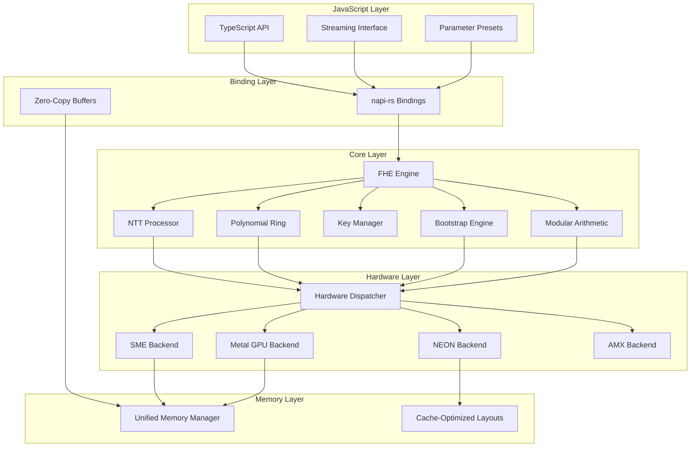
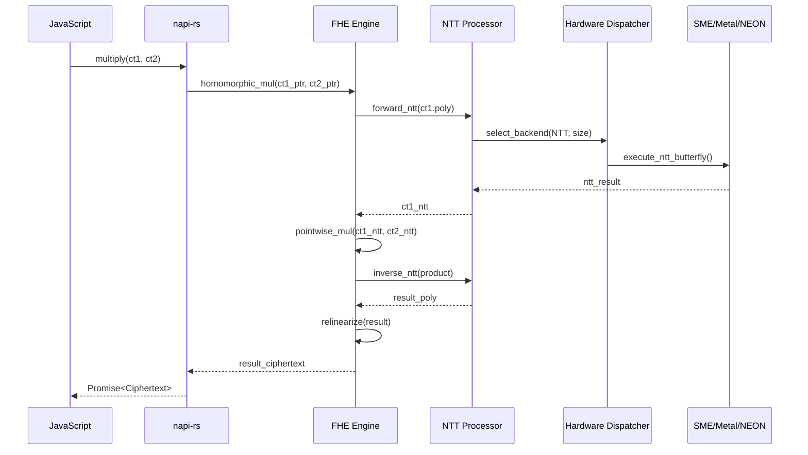

# Design Document: @digitaldefiance/node-fhe-accelerate

## Overview

This document describes the technical design for a high-performance FHE acceleration library targeting Apple M4 Max hardware. The library implements TFHE (Torus FHE) as the primary scheme due to its fast bootstrapping characteristics, with architecture extensible to BFV/CKKS schemes.

The design prioritizes:
1. **Sub-100ms operation latency** through aggressive hardware acceleration
2. **Exhaustive M4 Max exploitation** leveraging SME, AMX, Metal GPU, Neural Engine, NEON, ray tracing hardware, texture units, and unified memory
3. **Matrix-centric algorithm design** reformulating operations as matrix multiplies wherever possible to maximize SME/AMX utilization
4. **Unconventional acceleration paths** including Neural Engine for modular arithmetic, ray tracing for tree traversal, and texture sampling for polynomial evaluation
5. **Comprehensive benchmarking** of every hardware path for every operation
6. **Clean TypeScript API** with async operations and streaming support
7. **Correctness guarantees** through property-based testing of cryptographic invariants
8. **Practical voting systems** enabling decentralized elections on consumer hardware

### Hardware Acceleration Philosophy

**Leave no hardware feature untested.** The M4 Max contains:
- **SME**: 512-bit matrix tiles, outer products, streaming mode
- **AMX**: 32×32 matrix operations via Accelerate BLAS
- **Metal GPU**: 40 cores, 4096+ threads, ray tracing, texture sampling
- **Neural Engine**: 38 TOPS, quantized inference, batch operations
- **NEON**: 128-bit SIMD, gather/scatter, predication
- **Memory**: 512-bit bus, ~400 GB/s, hardware compression, unified architecture

We will benchmark every hardware unit for every applicable operation and select the optimal path at runtime. Unconventional approaches (Neural Engine for modular reduction, ray tracing for tree traversal) will be explored and benchmarked alongside conventional approaches.

### Killer Use Case: Decentralized Voting on Consumer Hardware

This library enables a novel approach to secure electronic voting:
- **Election officials** run tally servers on Mac Studios/M4 Max
- **Voters** submit encrypted ballots from any device
- **Complex fraud detection** runs on encrypted votes without revealing individual choices
- **Zero trust** - no one sees individual votes until final threshold decryption
- **Fast enough** for live election night results (10,000+ ballots/second)

This is the first practical FHE voting implementation that doesn't require datacenter infrastructure.

### Architecture Philosophy

The library follows a layered architecture:
- **JavaScript Layer**: TypeScript API (yarn), parameter validation, async orchestration
- **Binding Layer**: napi-rs for efficient JS-to-native calls with minimal copying
- **Core Layer**: C++ implementation of FHE primitives
- **Hardware Layer**: Platform-specific accelerator backends (SME, Metal, NEON)
- **Voting Layer**: High-level voting primitives (tallying, fraud detection, audit trails)

## Architecture



### Data Flow for Homomorphic Multiplication



## Components and Interfaces

### 1. FHE Engine (Core Orchestrator)

```cpp
// C++ Core Interface
namespace fhe_accelerate {

class FHEEngine {
public:
    // Initialization
    static std::unique_ptr<FHEEngine> create(const ParameterSet& params);
    
    // Key operations
    SecretKey generate_secret_key();
    PublicKey generate_public_key(const SecretKey& sk);
    EvaluationKey generate_eval_key(const SecretKey& sk, uint32_t decomp_base);
    BootstrapKey generate_bootstrap_key(const SecretKey& sk);
    
    // Encryption/Decryption
    Ciphertext encrypt(const Plaintext& pt, const PublicKey& pk);
    Plaintext decrypt(const Ciphertext& ct, const SecretKey& sk);
    
    // Homomorphic operations
    Ciphertext add(const Ciphertext& ct1, const Ciphertext& ct2);
    Ciphertext add_plain(const Ciphertext& ct, const Plaintext& pt);
    Ciphertext multiply(const Ciphertext& ct1, const Ciphertext& ct2);
    Ciphertext multiply_plain(const Ciphertext& ct, const Plaintext& pt);
    
    // Maintenance
    Ciphertext relinearize(const Ciphertext& ct, const EvaluationKey& ek);
    Ciphertext bootstrap(const Ciphertext& ct, const BootstrapKey& bk);
    
    // Noise management
    double get_noise_budget(const Ciphertext& ct, const SecretKey& sk);
    
private:
    std::unique_ptr<NTTProcessor> ntt_;
    std::unique_ptr<PolynomialRing> ring_;
    std::unique_ptr<HardwareDispatcher> dispatcher_;
    ParameterSet params_;
};

} // namespace fhe_accelerate
```

```typescript
// TypeScript API
export interface FHEEngine {
    // Key generation
    generateSecretKey(): Promise<SecretKey>;
    generatePublicKey(sk: SecretKey): Promise<PublicKey>;
    generateEvalKey(sk: SecretKey, decompBase?: number): Promise<EvaluationKey>;
    generateBootstrapKey(sk: SecretKey): Promise<BootstrapKey>;
    
    // Encryption/Decryption
    encrypt(plaintext: Plaintext, pk: PublicKey): Promise<Ciphertext>;
    decrypt(ciphertext: Ciphertext, sk: SecretKey): Promise<Plaintext>;
    
    // Homomorphic operations
    add(ct1: Ciphertext, ct2: Ciphertext): Promise<Ciphertext>;
    addPlain(ct: Ciphertext, pt: Plaintext): Promise<Ciphertext>;
    multiply(ct1: Ciphertext, ct2: Ciphertext): Promise<Ciphertext>;
    multiplyPlain(ct: Ciphertext, pt: Plaintext): Promise<Ciphertext>;
    
    // Maintenance
    relinearize(ct: Ciphertext, ek: EvaluationKey): Promise<Ciphertext>;
    bootstrap(ct: Ciphertext, bk: BootstrapKey): Promise<Ciphertext>;
    
    // Utilities
    getNoiseBudget(ct: Ciphertext, sk: SecretKey): Promise<number>;
}

export function createEngine(params: ParameterPreset | CustomParameters): Promise<FHEEngine>;
```

### 2. NTT Processor

The NTT Processor implements the Number Theoretic Transform using the Cooley-Tukey algorithm with hardware-specific optimizations.

```cpp
class NTTProcessor {
public:
    NTTProcessor(uint32_t degree, uint64_t modulus, HardwareDispatcher* dispatcher);
    
    // Core transforms
    void forward_ntt(uint64_t* coeffs, size_t n);
    void inverse_ntt(uint64_t* coeffs, size_t n);
    
    // Batch operations for GPU
    void forward_ntt_batch(uint64_t** coeffs_batch, size_t batch_size, size_t n);
    void inverse_ntt_batch(uint64_t** coeffs_batch, size_t batch_size, size_t n);
    
    // Precomputed tables
    void precompute_twiddles(uint64_t primitive_root);
    
private:
    std::vector<uint64_t> twiddles_;        // Forward twiddle factors
    std::vector<uint64_t> inv_twiddles_;    // Inverse twiddle factors
    uint64_t modulus_;
    uint64_t inv_n_;                         // Multiplicative inverse of n
    HardwareDispatcher* dispatcher_;
    
    // Hardware-specific implementations
    void ntt_sme(uint64_t* coeffs, size_t n);
    void ntt_metal(uint64_t* coeffs, size_t n);
    void ntt_neon(uint64_t* coeffs, size_t n);
};
```

### 3. Polynomial Ring

```cpp
class PolynomialRing {
public:
    PolynomialRing(uint32_t degree, const std::vector<uint64_t>& moduli);
    
    // Ring operations
    Polynomial add(const Polynomial& a, const Polynomial& b);
    Polynomial subtract(const Polynomial& a, const Polynomial& b);
    Polynomial multiply(const Polynomial& a, const Polynomial& b);
    Polynomial negate(const Polynomial& a);
    
    // Modular operations
    void reduce_mod_xn_plus_1(Polynomial& p);
    void switch_modulus(Polynomial& p, uint64_t new_mod);
    
    // RNS (Residue Number System) operations
    void to_rns(const Polynomial& p, std::vector<Polynomial>& rns_polys);
    Polynomial from_rns(const std::vector<Polynomial>& rns_polys);
    
private:
    uint32_t degree_;
    std::vector<uint64_t> moduli_;
    std::vector<std::unique_ptr<NTTProcessor>> ntt_processors_;
};
```

### 4. Hardware Dispatcher

```cpp
enum class HardwareBackend {
    SME,      // ARM Scalable Matrix Extension
    Metal,    // Apple GPU compute
    NEON,     // ARM SIMD
    AMX,      // Apple Matrix Coprocessor (via Accelerate)
    Fallback  // Pure C++ implementation
};

struct HardwareCapabilities {
    bool has_sme;
    bool has_metal;
    bool has_neon;
    bool has_amx;
    uint32_t metal_gpu_cores;
    uint64_t unified_memory_size;
};

class HardwareDispatcher {
public:
    HardwareDispatcher();
    
    // Capability detection
    HardwareCapabilities detect_capabilities();
    
    // Backend selection
    HardwareBackend select_backend(OperationType op, size_t data_size);
    void set_preferred_backend(HardwareBackend backend);
    
    // Execution
    void execute_ntt(uint64_t* data, size_t n, bool inverse);
    void execute_modmul(uint64_t* a, uint64_t* b, uint64_t* result, 
                        size_t n, uint64_t modulus);
    void execute_matrix_mul(const float* a, const float* b, float* c,
                           size_t m, size_t n, size_t k);
    
private:
    HardwareCapabilities caps_;
    HardwareBackend preferred_;
    
    // Backend implementations
    std::unique_ptr<SMEBackend> sme_;
    std::unique_ptr<MetalBackend> metal_;
    std::unique_ptr<NEONBackend> neon_;
    std::unique_ptr<AMXBackend> amx_;
};
```

### 5. SME Backend (M4 Max Specific)

```cpp
class SMEBackend {
public:
    SMEBackend();
    
    // SME streaming mode operations
    void enter_streaming_mode();
    void exit_streaming_mode();
    
    // Matrix operations for NTT butterflies
    void butterfly_matrix_mul(uint64_t* data, const uint64_t* twiddles, 
                              size_t stage, size_t n);
    
    // Outer product accumulation for polynomial multiplication
    void outer_product_accumulate(const uint64_t* a, const uint64_t* b,
                                  uint64_t* result, size_t n, uint64_t mod);
    
    // SME2 predicated operations for conditional coefficient processing
    void predicated_modular_reduce(uint64_t* data, size_t n, uint64_t mod);
    
private:
    bool streaming_active_;
    
    // SME register tile management
    void load_tile(uint32_t tile_id, const void* data, size_t rows, size_t cols);
    void store_tile(uint32_t tile_id, void* data, size_t rows, size_t cols);
    void zero_tile(uint32_t tile_id);
};
```

### 5a. Exhaustive Unconventional Hardware Exploitation Strategies

The M4 Max provides numerous hardware features that can be creatively applied to FHE workloads. **Every approach listed here MUST be implemented and benchmarked.**

#### Matrix-Centric NTT (SME/AMX Primary Target)

The NTT can be reformulated as a sequence of sparse matrix multiplications. This is the **highest priority optimization** because matrix units are the most powerful compute resources on M4 Max.

```cpp
class MatrixNTT {
public:
    // Express NTT as matrix multiplication
    // Each butterfly stage is a sparse matrix with 2 non-zeros per row
    // For degree N, we have log2(N) stages
    
    // Precompute butterfly matrices for each stage
    void precompute_butterfly_matrices(size_t degree, uint64_t modulus);
    
    // NTT via matrix multiplication (SME)
    // Process multiple polynomials simultaneously as a matrix
    void ntt_matrix_sme(uint64_t* polys, size_t num_polys, size_t degree);
    
    // NTT via Toeplitz matrix (AMX via Accelerate)
    // Single polynomial as matrix-vector product
    void ntt_toeplitz_amx(uint64_t* poly, size_t degree);
    
    // Batched NTT as dense matrix multiply
    // Stack polynomials as rows, twiddles as columns
    void ntt_batched_matrix(uint64_t** polys, size_t batch_size, size_t degree);
    
private:
    // Butterfly matrices stored in SME-friendly tile format
    std::vector<SMETile> butterfly_tiles_;
    
    // Toeplitz matrices for AMX
    std::vector<float*> toeplitz_matrices_;  // Accelerate uses float
};
```

#### Polynomial Multiplication as Matrix Operations

```cpp
class MatrixPolyMul {
public:
    // Polynomial multiplication as Toeplitz matrix-vector product
    // p1 * p2 = Toeplitz(p1) @ p2
    // This maps directly to AMX/SME matrix operations
    
    void poly_mul_toeplitz_sme(
        const uint64_t* p1, const uint64_t* p2,
        uint64_t* result, size_t degree, uint64_t modulus
    );
    
    // Circulant matrix formulation for cyclic convolution
    // Useful for X^N + 1 reduction
    void poly_mul_circulant_amx(
        const uint64_t* p1, const uint64_t* p2,
        uint64_t* result, size_t degree, uint64_t modulus
    );
    
    // Batch polynomial multiplication as matrix-matrix multiply
    // Process multiple polynomial pairs simultaneously
    void poly_mul_batch_matrix(
        uint64_t** p1_batch, uint64_t** p2_batch,
        uint64_t** results, size_t batch_size, size_t degree
    );
    
private:
    // Build Toeplitz matrix from polynomial coefficients
    void build_toeplitz(const uint64_t* poly, size_t degree, uint64_t* matrix);
};
```

#### Neural Engine for Parallel Modular Reduction

The Neural Engine (38 TOPS) is designed for ML inference but can be repurposed for parallel arithmetic:

```cpp
class NeuralEngineBackend {
public:
    // Encode modular reduction as a quantized neural network
    // Input: coefficients as int8/int16 tensors
    // Network: learned approximation of mod q operation
    // Output: reduced coefficients
    
    // This works because:
    // 1. Modular reduction for fixed q is a deterministic function
    // 2. Neural Engine excels at parallel element-wise operations
    // 3. We can train a small network to approximate mod for specific q values
    // 4. For exact results, use Neural Engine for approximate + CPU for correction
    
    void compile_reduction_network(uint64_t modulus);
    void batch_reduce(int16_t* coeffs, size_t n);
    
    // Exact modular reduction via Neural Engine + correction
    // Neural Engine computes approximate quotient
    // CPU computes exact remainder using approximate quotient
    void exact_batch_reduce(uint64_t* coeffs, size_t n, uint64_t modulus);
    
    // For TFHE's small plaintext space (typically 2-4 bits),
    // we can use Neural Engine for parallel LUT evaluation
    void parallel_lut_eval(const int8_t* inputs, const int8_t* lut, 
                           int8_t* outputs, size_t batch_size);
    
    // Poseidon hash for ZK proofs
    // S-box and MDS matrix as neural network layers
    void poseidon_hash_batch(
        const uint64_t* inputs, uint64_t* outputs,
        size_t batch_size, size_t input_size
    );
    
    // Montgomery multiplication approximation
    // Neural Engine computes approximate product
    // Useful for initial reduction before exact correction
    void montgomery_mul_approx(
        const int16_t* a, const int16_t* b,
        int16_t* result, size_t n
    );
    
private:
    MLModel* reduction_model_;
    MLModel* poseidon_model_;
    MLModel* montgomery_model_;
    ANECompiler* compiler_;
    
    // Train reduction network for specific modulus
    void train_reduction_network(uint64_t modulus);
};
```

#### GPU Ray Tracing Hardware for Tree Traversal

The M4 Max GPU has hardware ray tracing acceleration. We can exploit this for tree-structured operations:

```cpp
class RayTracingBackend {
public:
    // Key switching involves traversing decomposition trees
    // Ray tracing BVH traversal hardware can accelerate this
    
    // Encode key switching as ray-scene intersection:
    // - "Scene" = decomposition tree structure (BVH)
    // - "Rays" = coefficient values to decompose
    // - "Intersections" = decomposition digits
    
    void build_decomposition_bvh(uint32_t base, uint32_t levels);
    void trace_decomposition(const uint64_t* coeffs, uint32_t* digits, size_t n);
    
    // Bootstrap accumulator rotation can use ray tracing for
    // parallel index computation in blind rotate
    void compute_rotation_indices(const uint64_t* lwe_samples, 
                                  uint32_t* rotation_amounts, size_t n);
    
    // Merkle tree traversal for ZK proofs
    // BVH structure maps naturally to Merkle trees
    void merkle_tree_traverse(
        const uint8_t* root, const uint8_t* leaf,
        uint8_t* proof_path, size_t tree_depth
    );
    
    // Binary search via ray tracing
    // Useful for finding twiddle factors, LUT indices
    void binary_search_batch(
        const uint64_t* sorted_array, size_t array_size,
        const uint64_t* queries, uint32_t* indices, size_t num_queries
    );
    
private:
    id<MTLAccelerationStructure> decomp_bvh_;
    id<MTLAccelerationStructure> merkle_bvh_;
    id<MTLComputePipelineState> trace_pipeline_;
};
```

#### Texture Sampling Hardware for Polynomial Evaluation

```cpp
class TextureSamplingBackend {
public:
    // GPU texture units provide hardware interpolation
    // We can encode polynomial coefficients as textures and use
    // texture sampling for fast polynomial evaluation at multiple points
    
    // Useful for:
    // 1. Evaluating test polynomials in bootstrapping
    // 2. Computing twiddle factors on-the-fly
    // 3. Lookup table evaluation with interpolation
    // 4. Polynomial commitment evaluation
    
    void encode_polynomial_as_texture(const uint64_t* coeffs, size_t degree);
    void sample_polynomial(const float* eval_points, uint64_t* results, size_t n);
    
    // Twiddle factor texture
    // Store precomputed twiddles as 2D texture
    // Sample at (stage, index) for butterfly operations
    void create_twiddle_texture(size_t max_degree, uint64_t modulus);
    void sample_twiddles(uint32_t stage, const uint32_t* indices,
                         uint64_t* twiddles, size_t n);
    
    // LUT as texture with hardware interpolation
    // For approximate function evaluation
    void create_lut_texture(const uint64_t* lut, size_t size);
    void eval_lut_interpolated(const float* inputs, uint64_t* outputs, size_t n);
    
    // Bilinear interpolation for 2D polynomial evaluation
    // Useful for multivariate polynomials
    void eval_bivariate_polynomial(
        const uint64_t* coeffs, size_t degree_x, size_t degree_y,
        const float* x_points, const float* y_points,
        uint64_t* results, size_t n
    );
    
private:
    id<MTLTexture> poly_texture_;
    id<MTLTexture> twiddle_texture_;
    id<MTLTexture> lut_texture_;
    id<MTLSamplerState> sampler_;
};
```

#### Memory Controller Features

```cpp
class MemoryOptimizer {
public:
    // M4 Max unified memory with 512-bit bus (~400 GB/s)
    
    // Exploit memory compression for ciphertext storage
    // Apple Silicon has hardware memory compression
    void enable_ciphertext_compression();
    
    // Use memory tagging for ciphertext integrity
    // ARM MTE (Memory Tagging Extension) can detect corruption
    void enable_memory_tagging();
    
    // Prefetch patterns optimized for NTT access patterns
    // NTT has predictable butterfly access - prefetch ahead
    void configure_ntt_prefetch(size_t degree, size_t stage);
    
    // Zero-copy buffer sharing between CPU/GPU/Neural Engine
    // All accelerators share the same physical memory
    IOSurfaceRef create_shared_surface(size_t size);
    
    // Cache-line aligned allocation for M4 Max
    // L1: 192KB per P-core, 128KB per E-core
    // L2: 32MB shared
    // Cache line: 128 bytes
    void* allocate_cache_aligned(size_t size, size_t alignment = 128);
    
    // NUMA-aware allocation (if applicable)
    void* allocate_near_accelerator(size_t size, HardwareBackend target);
    
    // Memory bandwidth measurement
    double measure_bandwidth(HardwareBackend source, HardwareBackend dest, size_t size);
    
private:
    bool compression_enabled_;
    bool tagging_enabled_;
};
```

#### Secure Enclave Integration

```cpp
class SecureEnclaveBackend {
public:
    // Use Secure Enclave for key protection
    // Secret keys never leave the secure enclave
    
    // Generate secret key inside Secure Enclave
    SecureKeyHandle generate_secret_key_secure();
    
    // Decrypt inside Secure Enclave (for final results only)
    // Ciphertext goes in, plaintext comes out, key never exposed
    Plaintext decrypt_secure(const Ciphertext& ct, SecureKeyHandle sk);
    
    // Sign ciphertexts for authenticity
    void sign_ciphertext(Ciphertext& ct, SecureKeyHandle sk);
    bool verify_ciphertext(const Ciphertext& ct, const PublicKey& pk);
    
    // Threshold key share storage in Secure Enclave
    SecureKeyHandle store_key_share(const SecretKeyShare& share);
    PartialDecryption partial_decrypt_secure(
        const Ciphertext& ct, SecureKeyHandle share_handle
    );
    
private:
    SecKeyRef enclave_key_;
};
```

#### AMX (Apple Matrix Coprocessor) via Accelerate

```cpp
class AMXBackend {
public:
    // AMX provides 32x32 matrix operations
    // Accessible through Accelerate framework's BLAS/BNNS
    
    // Use for NTT butterfly matrices
    // Each NTT stage can be expressed as matrix multiplication
    void ntt_via_matrix(uint64_t* data, size_t n);
    
    // Polynomial multiplication as matrix-vector product
    // Toeplitz matrix representation of polynomial multiplication
    void poly_mul_toeplitz(const uint64_t* a, const uint64_t* b,
                           uint64_t* result, size_t n);
    
    // Key switching matrix operations
    void key_switch_matrix(const uint64_t* ct, const uint64_t* ksw_key,
                           uint64_t* result, size_t n, size_t levels);
    
    // Batch inner products for gadget decomposition
    void batch_inner_product(
        const uint64_t** vectors_a, const uint64_t** vectors_b,
        uint64_t* results, size_t batch_size, size_t vector_len
    );
    
    // R1CS constraint evaluation for ZK proofs
    // A*w ⊙ B*w = C*w as matrix operations
    bool evaluate_r1cs_constraints(
        const SparseMatrix& A, const SparseMatrix& B, const SparseMatrix& C,
        const std::vector<uint64_t>& witness
    );
    
private:
    // Accelerate BLAS wrappers
    void cblas_gemm_wrapper(/* ... */);
    void cblas_gemv_wrapper(/* ... */);
};
```

#### Speculative Execution for Predictable Paths

```cpp
class SpeculativeExecutor {
public:
    // FHE operations often have predictable patterns
    // We can speculatively execute likely paths
    
    // For programmable bootstrapping with known LUT:
    // - Speculatively compute results for all possible inputs
    // - Select correct result based on actual decrypted value
    void speculative_pbs(const LWECiphertext& ct, const BootstrapKey& bk,
                         const std::vector<LookupTable>& possible_luts,
                         LWECiphertext& result);
    
    // For circuits with branching:
    // - Execute both branches in parallel
    // - Obliviously select correct result
    void speculative_branch(const Ciphertext& condition,
                           std::function<Ciphertext()> true_branch,
                           std::function<Ciphertext()> false_branch,
                           Ciphertext& result);
    
    // Speculative key switching
    // Pre-compute key switch for likely next operations
    void speculative_key_switch(
        const Ciphertext& ct,
        const std::vector<EvaluationKey>& likely_keys,
        std::vector<Ciphertext>& precomputed_results
    );
    
    // Speculative NTT
    // If we know polynomial will be multiplied, pre-transform
    void speculative_ntt(Polynomial& poly);
    
private:
    // Thread pool for parallel speculative execution
    std::unique_ptr<ThreadPool> thread_pool_;
    
    // Cache of speculative results
    std::unordered_map<uint64_t, Ciphertext> speculative_cache_;
};
```

#### Advanced SIMD (NEON/SVE2)

```cpp
class AdvancedSIMDBackend {
public:
    // ARM SVE2/NEON advanced features
    
    // Use gather loads for NTT butterfly patterns
    // Instead of strided access, gather non-contiguous elements
    void ntt_gather_butterfly(uint64_t* data, const uint32_t* indices,
                              const uint64_t* twiddles, size_t n);
    
    // Scatter stores for inverse NTT
    void intt_scatter_butterfly(uint64_t* data, const uint32_t* indices,
                                const uint64_t* twiddles, size_t n);
    
    // Predicated operations for conditional modular reduction
    // Only reduce coefficients that exceed modulus
    void predicated_reduce(uint64_t* data, size_t n, uint64_t mod);
    
    // Horizontal reductions for inner products
    uint64_t horizontal_modmul_sum(const uint64_t* a, const uint64_t* b,
                                   size_t n, uint64_t mod);
    
    // Vectorized Montgomery multiplication
    void montgomery_mul_vec(const uint64_t* a, const uint64_t* b,
                            uint64_t* result, size_t n, uint64_t mod);
    
    // Vectorized Barrett reduction
    void barrett_reduce_vec(uint64_t* data, size_t n, uint64_t mod);
    
    // Multi-limb arithmetic with NEON
    void multi_limb_add_vec(const uint64_t* a, const uint64_t* b,
                            uint64_t* result, size_t limbs, size_t n);
    void multi_limb_mul_vec(const uint64_t* a, const uint64_t* b,
                            uint64_t* result, size_t limbs, size_t n);
    
private:
    // Precomputed gather/scatter index tables
    std::vector<uint32_t> ntt_gather_indices_;
    std::vector<uint32_t> ntt_scatter_indices_;
};
```

#### Comprehensive Hardware Benchmark Suite

```cpp
class HardwareBenchmarkSuite {
public:
    struct BenchmarkResult {
        HardwareBackend backend;
        std::string operation;
        size_t data_size;
        double latency_us;
        double throughput_ops_per_sec;
        double bandwidth_gb_per_sec;
        double power_watts;  // If measurable
    };
    
    // Benchmark every hardware path for every operation
    std::vector<BenchmarkResult> benchmark_all();
    
    // Individual operation benchmarks
    std::vector<BenchmarkResult> benchmark_ntt(size_t degree);
    std::vector<BenchmarkResult> benchmark_modmul(size_t n);
    std::vector<BenchmarkResult> benchmark_poly_mul(size_t degree);
    std::vector<BenchmarkResult> benchmark_key_switch(size_t n, size_t levels);
    std::vector<BenchmarkResult> benchmark_bootstrap(size_t n);
    
    // Matrix vs scalar comparisons
    std::vector<BenchmarkResult> benchmark_matrix_vs_scalar();
    
    // Neural Engine specific benchmarks
    std::vector<BenchmarkResult> benchmark_neural_engine_modred();
    std::vector<BenchmarkResult> benchmark_neural_engine_poseidon();
    
    // Ray tracing specific benchmarks
    std::vector<BenchmarkResult> benchmark_ray_tracing_decomp();
    std::vector<BenchmarkResult> benchmark_ray_tracing_merkle();
    
    // Texture sampling benchmarks
    std::vector<BenchmarkResult> benchmark_texture_poly_eval();
    std::vector<BenchmarkResult> benchmark_texture_twiddles();
    
    // Memory system benchmarks
    std::vector<BenchmarkResult> benchmark_memory_bandwidth();
    std::vector<BenchmarkResult> benchmark_cache_effects();
    
    // Generate comprehensive report
    void generate_report(const std::string& output_path);
    
    // Get optimal backend for operation
    HardwareBackend get_optimal_backend(
        const std::string& operation, size_t data_size
    );
    
private:
    std::vector<BenchmarkResult> results_;
    
    // Statistical analysis
    double compute_mean(const std::vector<double>& samples);
    double compute_stddev(const std::vector<double>& samples);
    bool is_statistically_significant(
        const std::vector<double>& a, const std::vector<double>& b
    );
};
```

### 6. Metal GPU Backend

```cpp
class MetalBackend {
public:
    MetalBackend();
    ~MetalBackend();
    
    // Shader compilation
    void compile_shaders();
    
    // NTT operations
    void ntt_batch(uint64_t** polys, size_t batch_size, size_t degree,
                   const uint64_t* twiddles, uint64_t modulus);
    
    // Modular arithmetic
    void modmul_batch(uint64_t* a, uint64_t* b, uint64_t* result,
                      size_t n, uint64_t modulus);
    
    // Bootstrap accumulator
    void bootstrap_accumulator(uint64_t* acc, const uint64_t* bk,
                               size_t n, size_t num_bits);
    
private:
    id<MTLDevice> device_;
    id<MTLCommandQueue> command_queue_;
    id<MTLComputePipelineState> ntt_pipeline_;
    id<MTLComputePipelineState> modmul_pipeline_;
    id<MTLComputePipelineState> bootstrap_pipeline_;
    
    // Unified memory buffers
    id<MTLBuffer> create_shared_buffer(size_t size);
};
```

### 7. Bootstrap Engine (TFHE)

```cpp
class BootstrapEngine {
public:
    BootstrapEngine(const ParameterSet& params, HardwareDispatcher* dispatcher);
    
    // Key generation
    BootstrapKey generate_key(const SecretKey& sk);
    
    // Bootstrapping
    LWECiphertext bootstrap(const LWECiphertext& ct, const BootstrapKey& bk);
    
    // Programmable bootstrapping
    LWECiphertext programmable_bootstrap(const LWECiphertext& ct,
                                         const BootstrapKey& bk,
                                         const LookupTable& lut);
    
private:
    // TFHE-specific operations
    void blind_rotate(GLWECiphertext& acc, const LWECiphertext& ct,
                      const BootstrapKey& bk);
    void sample_extract(LWECiphertext& result, const GLWECiphertext& acc);
    void key_switch(LWECiphertext& result, const LWECiphertext& ct,
                    const KeySwitchKey& ksk);
    
    ParameterSet params_;
    HardwareDispatcher* dispatcher_;
};
```

### 8. Parameter Sets

```cpp
struct ParameterSet {
    // Polynomial parameters
    uint32_t poly_degree;           // N: 1024, 2048, 4096, etc.
    std::vector<uint64_t> moduli;   // q: coefficient modulus chain
    
    // TFHE-specific
    uint32_t lwe_dimension;         // n: LWE dimension
    double lwe_noise_std;           // σ: noise standard deviation
    uint32_t glwe_dimension;        // k: GLWE dimension
    uint32_t decomp_base_log;       // Base for gadget decomposition
    uint32_t decomp_level;          // Number of decomposition levels
    
    // Security
    SecurityLevel security;         // 128, 192, or 256 bits
    
    // Derived parameters
    uint64_t plaintext_modulus;     // t: plaintext space
    double noise_budget;            // Estimated initial noise budget
    uint32_t max_mult_depth;        // Maximum multiplication depth
};

// Preset configurations
ParameterSet TFHE_128_FAST();       // Fast bootstrapping, 128-bit security
ParameterSet TFHE_128_BALANCED();   // Balanced performance/security
ParameterSet TFHE_256_SECURE();     // Maximum security
ParameterSet BFV_128_SIMD();        // BFV with SIMD packing
ParameterSet CKKS_128_ML();         // CKKS for ML workloads
ParameterSet TFHE_128_VOTING();     // Optimized for voting (fast, compact)
```

### 9. Voting-Specific Components

#### 9.1 Ballot Aggregator

```cpp
class BallotAggregator {
public:
    BallotAggregator(const ParameterSet& params, HardwareDispatcher* dispatcher);
    
    // Ballot ingestion
    void add_ballot(const EncryptedBallot& ballot);
    void add_ballot_batch(const std::vector<EncryptedBallot>& ballots);
    
    // Homomorphic tallying
    EncryptedTally compute_tally();
    EncryptedTally get_running_tally() const;
    
    // Weighted voting
    EncryptedTally compute_weighted_tally(const std::vector<uint64_t>& weights);
    
    // Statistics (on encrypted data)
    EncryptedStats compute_statistics();
    
    // Performance
    size_t get_ballot_count() const;
    double get_throughput() const;  // ballots/second
    
private:
    std::vector<Ciphertext> accumulated_votes_;
    ParameterSet params_;
    HardwareDispatcher* dispatcher_;
    
    // Optimized accumulation using GPU batching
    void batch_accumulate(const std::vector<Ciphertext>& batch);
};

struct EncryptedBallot {
    std::vector<Ciphertext> choices;  // One per race/question
    std::vector<uint8_t> metadata;    // Encrypted voter metadata
    uint64_t timestamp;
    std::vector<uint8_t> signature;   // ZK proof of validity
};

struct EncryptedTally {
    std::vector<Ciphertext> totals;   // One per candidate/option
    uint64_t ballot_count;
    double noise_budget;
};
```

#### 9.2 Fraud Detector

```cpp
class FraudDetector {
public:
    FraudDetector(const ParameterSet& params, HardwareDispatcher* dispatcher);
    
    // Duplicate detection (on encrypted data)
    std::vector<FraudAlert> detect_duplicates(
        const std::vector<EncryptedBallot>& ballots
    );
    
    // Statistical anomaly detection
    std::vector<FraudAlert> detect_anomalies(
        const EncryptedTally& tally,
        const StatisticalModel& expected
    );
    
    // Time-series analysis
    std::vector<FraudAlert> analyze_voting_patterns(
        const std::vector<TimestampedBallot>& ballots
    );
    
    // Threshold alerts (without decryption)
    std::vector<FraudAlert> check_thresholds(
        const EncryptedTally& tally,
        const std::vector<Threshold>& thresholds
    );
    
private:
    ParameterSet params_;
    HardwareDispatcher* dispatcher_;
    
    // Encrypted comparison operations
    Ciphertext encrypted_greater_than(const Ciphertext& a, const Ciphertext& b);
    Ciphertext encrypted_equals(const Ciphertext& a, const Ciphertext& b);
    Ciphertext encrypted_in_range(const Ciphertext& value, uint64_t min, uint64_t max);
};

struct FraudAlert {
    enum class Type {
        DUPLICATE_VOTE,
        STATISTICAL_ANOMALY,
        TIMING_ANOMALY,
        THRESHOLD_EXCEEDED
    };
    
    Type type;
    std::string description;
    uint64_t timestamp;
    double confidence;  // 0.0 to 1.0
    std::vector<uint8_t> encrypted_evidence;  // Still encrypted
};
```

#### 9.3 Threshold Decryptor

```cpp
class ThresholdDecryptor {
public:
    // Key generation
    struct ThresholdKeys {
        std::vector<SecretKeyShare> shares;  // N shares
        PublicKey public_key;
        uint32_t threshold;  // M required shares
    };
    
    static ThresholdKeys generate_threshold_keys(
        uint32_t threshold,
        uint32_t total_shares,
        const ParameterSet& params
    );
    
    // Partial decryption
    PartialDecryption partial_decrypt(
        const Ciphertext& ct,
        const SecretKeyShare& share
    );
    
    // Combine partial decryptions
    Plaintext combine_partial_decryptions(
        const Ciphertext& ct,
        const std::vector<PartialDecryption>& partials
    );
    
    // Verification
    bool verify_partial_decryption(
        const PartialDecryption& partial,
        const PublicKey& pk
    );
    
private:
    ParameterSet params_;
};

struct SecretKeyShare {
    uint32_t share_id;
    Polynomial share_poly;
    std::vector<uint8_t> commitment;  // For verification
};

struct PartialDecryption {
    uint32_t share_id;
    Polynomial partial_result;
    std::vector<uint8_t> proof;  // ZK proof of correctness
};
```

#### 9.4 Audit Logger

```cpp
class AuditLogger {
public:
    AuditLogger(const std::string& log_path);
    
    // Logging operations
    void log_ballot_received(const EncryptedBallot& ballot);
    void log_tally_computed(const EncryptedTally& tally);
    void log_fraud_alert(const FraudAlert& alert);
    void log_decryption(const std::vector<uint32_t>& share_ids);
    
    // Cryptographic integrity
    std::vector<uint8_t> get_log_hash() const;
    bool verify_log_integrity() const;
    
    // Export
    void export_json(const std::string& path) const;
    void export_csv(const std::string& path) const;
    
    // Verification
    struct AuditProof {
        std::vector<uint8_t> merkle_root;
        std::vector<std::vector<uint8_t>> merkle_path;
        std::vector<uint8_t> signature;
    };
    
    AuditProof generate_proof(uint64_t entry_id) const;
    bool verify_proof(const AuditProof& proof, uint64_t entry_id) const;
    
private:
    struct AuditEntry {
        uint64_t id;
        uint64_t timestamp;
        std::string operation;
        std::vector<uint8_t> data_hash;
        std::vector<uint8_t> prev_hash;
    };
    
    std::vector<AuditEntry> entries_;
    std::string log_path_;
    
    // Merkle tree for efficient verification
    std::vector<std::vector<uint8_t>> merkle_tree_;
    void update_merkle_tree();
};
```

#### 9.5 Real-Time Streaming

```cpp
class TallyStreamer {
public:
    TallyStreamer(BallotAggregator* aggregator);
    
    // WebSocket-style streaming
    void start_streaming(uint16_t port);
    void stop_streaming();
    
    // Subscribe to updates
    using UpdateCallback = std::function<void(const EncryptedTally&)>;
    uint64_t subscribe(UpdateCallback callback);
    void unsubscribe(uint64_t subscription_id);
    
    // Broadcast updates
    void broadcast_update(const EncryptedTally& tally);
    
    // Statistics
    size_t get_subscriber_count() const;
    double get_update_rate() const;  // updates/second
    
private:
    BallotAggregator* aggregator_;
    std::vector<UpdateCallback> subscribers_;
    std::atomic<bool> streaming_active_;
    
    // Thread-safe update queue
    std::queue<EncryptedTally> update_queue_;
    std::mutex queue_mutex_;
};
```

### 10. TypeScript Voting API

```typescript
// Voting-specific types
export interface EncryptedBallot {
    choices: Ciphertext[];
    metadata: Uint8Array;
    timestamp: number;
    signature: Uint8Array;
}

export interface EncryptedTally {
    totals: Ciphertext[];
    ballotCount: number;
    noiseBudget: number;
}

export interface FraudAlert {
    type: 'duplicate' | 'anomaly' | 'timing' | 'threshold';
    description: string;
    timestamp: number;
    confidence: number;
    encryptedEvidence: Uint8Array;
}

export interface ThresholdKeys {
    shares: SecretKeyShare[];
    publicKey: PublicKey;
    threshold: number;
}

export interface SecretKeyShare {
    shareId: number;
    handle: bigint;
}

// Voting engine interface
export interface VotingEngine extends FHEEngine {
    // Ballot operations
    encryptBallot(choices: number[], pk: PublicKey): Promise<EncryptedBallot>;
    submitBallot(ballot: EncryptedBallot): Promise<void>;
    submitBallotBatch(ballots: EncryptedBallot[]): Promise<void>;
    
    // Tallying
    computeTally(): Promise<EncryptedTally>;
    getRunningTally(): Promise<EncryptedTally>;
    
    // Fraud detection
    detectDuplicates(ballots: EncryptedBallot[]): Promise<FraudAlert[]>;
    detectAnomalies(tally: EncryptedTally): Promise<FraudAlert[]>;
    
    // Threshold decryption
    generateThresholdKeys(threshold: number, total: number): Promise<ThresholdKeys>;
    partialDecrypt(ct: Ciphertext, share: SecretKeyShare): Promise<PartialDecryption>;
    combinePartialDecryptions(ct: Ciphertext, partials: PartialDecryption[]): Promise<Plaintext>;
    
    // Audit trail
    getAuditLog(): Promise<AuditEntry[]>;
    exportAuditLog(format: 'json' | 'csv'): Promise<string>;
    verifyAuditIntegrity(): Promise<boolean>;
    
    // Real-time streaming
    subscribeToTally(callback: (tally: EncryptedTally) => void): Promise<number>;
    unsubscribeFromTally(subscriptionId: number): Promise<void>;
}

export function createVotingEngine(params: ParameterPreset | CustomParameters): Promise<VotingEngine>;
```

### 11. Example: Complete Voting System

```typescript
// examples/voting-system.ts
import { createVotingEngine } from '@digitaldefiance/node-fhe-accelerate';

async function runElection() {
    // Setup: Election officials generate threshold keys
    const engine = await createVotingEngine('tfhe-128-voting');
    const { shares, publicKey } = await engine.generateThresholdKeys(3, 5);
    
    console.log('Election setup: 3-of-5 threshold decryption');
    console.log('Public key distributed to voters');
    
    // Voting phase: Voters encrypt ballots
    const ballots: EncryptedBallot[] = [];
    for (let i = 0; i < 10000; i++) {
        const choice = Math.floor(Math.random() * 3); // 3 candidates
        const ballot = await engine.encryptBallot([choice], publicKey);
        ballots.push(ballot);
    }
    
    console.log(`Received ${ballots.length} encrypted ballots`);
    
    // Batch submission for performance
    await engine.submitBallotBatch(ballots);
    
    // Real-time tallying
    const subscriptionId = await engine.subscribeToTally((tally) => {
        console.log(`Running tally: ${tally.ballotCount} ballots processed`);
        console.log(`Noise budget: ${tally.noiseBudget.toFixed(2)} bits`);
    });
    
    // Fraud detection (on encrypted data)
    const duplicates = await engine.detectDuplicates(ballots);
    if (duplicates.length > 0) {
        console.warn(`Detected ${duplicates.length} potential duplicate votes`);
    }
    
    const anomalies = await engine.detectAnomalies(await engine.getRunningTally());
    if (anomalies.length > 0) {
        console.warn(`Detected ${anomalies.length} statistical anomalies`);
    }
    
    // Final tally (still encrypted)
    const encryptedTally = await engine.computeTally();
    console.log('Tallying complete - results still encrypted');
    
    // Threshold decryption: 3 officials decrypt
    const partials = await Promise.all([
        engine.partialDecrypt(encryptedTally.totals[0], shares[0]),
        engine.partialDecrypt(encryptedTally.totals[0], shares[1]),
        engine.partialDecrypt(encryptedTally.totals[0], shares[2])
    ]);
    
    const results = await engine.combinePartialDecryptions(
        encryptedTally.totals[0],
        partials
    );
    
    console.log('Election results:', results);
    
    // Audit trail
    const auditLog = await engine.getAuditLog();
    console.log(`Audit log: ${auditLog.length} entries`);
    
    const isValid = await engine.verifyAuditIntegrity();
    console.log(`Audit integrity: ${isValid ? 'VALID' : 'INVALID'}`);
    
    // Export for election officials
    await engine.exportAuditLog('json');
    
    // Cleanup
    await engine.unsubscribeFromTally(subscriptionId);
}

runElection().catch(console.error);
```

### 12. Zero-Knowledge Proof System

#### 12.1 ZK Prover Architecture

```cpp
class ZKProver {
public:
    enum class ProofSystem {
        BULLETPROOFS,  // Range proofs, no trusted setup
        GROTH16,       // Fast verification, trusted setup
        PLONK,         // Universal setup, flexible
        STARK          // No setup, post-quantum
    };
    
    ZKProver(ProofSystem system, HardwareDispatcher* dispatcher);
    
    // Ballot validity proofs (Bulletproofs)
    BulletproofProof prove_ballot_validity(
        uint64_t choice,
        uint64_t num_candidates,
        const EncryptedBallot& ballot
    );
    
    // Eligibility proofs (Groth16)
    Groth16Proof prove_eligibility(
        const VoterCredential& credential,
        const MerkleProof& voter_roll_proof
    );
    
    // Uniqueness proofs (Bulletproofs)
    BulletproofProof prove_uniqueness(
        const VoterCredential& credential,
        const std::vector<uint8_t>& nullifier_set
    );
    
    // Tally correctness proofs (PLONK)
    PlonkProof prove_tally_correctness(
        const std::vector<EncryptedBallot>& ballots,
        const EncryptedTally& tally,
        const ComputationTrace& trace
    );
    
    // Decryption correctness proofs (Groth16)
    Groth16Proof prove_partial_decryption(
        const Ciphertext& ct,
        const PartialDecryption& partial,
        const SecretKeyShare& share
    );
    
    // Batch proving
    std::vector<BulletproofProof> prove_ballot_validity_batch(
        const std::vector<uint64_t>& choices,
        uint64_t num_candidates,
        const std::vector<EncryptedBallot>& ballots
    );
    
private:
    ProofSystem system_;
    HardwareDispatcher* dispatcher_;
    
    // Backend implementations
    std::unique_ptr<BulletproofsBackend> bulletproofs_;
    std::unique_ptr<Groth16Backend> groth16_;
    std::unique_ptr<PlonkBackend> plonk_;
    std::unique_ptr<StarkBackend> stark_;
};
```

#### 12.2 Hardware-Accelerated ZK Backends

```cpp
// Bulletproofs Backend (Range Proofs)
class BulletproofsBackend {
public:
    BulletproofsBackend(HardwareDispatcher* dispatcher);
    
    // Range proof generation
    BulletproofProof prove_range(
        uint64_t value,
        uint64_t min,
        uint64_t max,
        const Commitment& commitment
    );
    
    // Verification
    bool verify_range(const BulletproofProof& proof);
    
    // Batch verification (faster)
    bool verify_range_batch(const std::vector<BulletproofProof>& proofs);
    
private:
    // Inner product argument
    InnerProductProof compute_inner_product(
        const std::vector<FieldElement>& a,
        const std::vector<FieldElement>& b
    );
    
    // Metal GPU acceleration for parallel operations
    void parallel_pedersen_commitments(
        const std::vector<FieldElement>& values,
        std::vector<Commitment>& commitments
    );
    
    HardwareDispatcher* dispatcher_;
};

// Groth16 Backend (Eligibility Proofs)
class Groth16Backend {
public:
    Groth16Backend(HardwareDispatcher* dispatcher);
    
    // Trusted setup
    struct ProvingKey {
        std::vector<G1Point> alpha_g1;
        std::vector<G1Point> beta_g1;
        std::vector<G2Point> beta_g2;
        std::vector<G1Point> delta_g1;
        // ... more setup parameters
    };
    
    struct VerifyingKey {
        G1Point alpha_g1;
        G2Point beta_g2;
        G2Point delta_g2;
        std::vector<G1Point> ic;  // Public input commitments
    };
    
    std::pair<ProvingKey, VerifyingKey> setup(const R1CS& circuit);
    
    // Proof generation
    Groth16Proof prove(
        const ProvingKey& pk,
        const R1CS& circuit,
        const Witness& witness
    );
    
    // Verification (pairing-based)
    bool verify(
        const VerifyingKey& vk,
        const Groth16Proof& proof,
        const std::vector<FieldElement>& public_inputs
    );
    
private:
    // Multi-scalar multiplication (MSM) - GPU accelerated
    G1Point msm_g1(
        const std::vector<G1Point>& bases,
        const std::vector<FieldElement>& scalars
    );
    
    // Pippenger's algorithm on Metal GPU
    G1Point pippenger_msm(
        const std::vector<G1Point>& bases,
        const std::vector<FieldElement>& scalars
    );
    
    // Pairing computation
    FieldElement pairing(const G1Point& p, const G2Point& q);
    
    HardwareDispatcher* dispatcher_;
};

// PLONK Backend (Tally Correctness)
class PlonkBackend {
public:
    PlonkBackend(HardwareDispatcher* dispatcher);
    
    // Universal trusted setup (one-time, reusable)
    struct UniversalSRS {
        std::vector<G1Point> powers_of_tau_g1;
        std::vector<G2Point> powers_of_tau_g2;
        size_t max_degree;
    };
    
    UniversalSRS universal_setup(size_t max_degree);
    
    // Circuit-specific setup (fast, no ceremony)
    struct ProvingKey {
        UniversalSRS srs;
        std::vector<Polynomial> selector_polynomials;
        std::vector<Polynomial> permutation_polynomials;
    };
    
    ProvingKey circuit_setup(
        const UniversalSRS& srs,
        const PlonkCircuit& circuit
    );
    
    // Proof generation
    PlonkProof prove(
        const ProvingKey& pk,
        const PlonkCircuit& circuit,
        const Witness& witness
    );
    
    // Verification
    bool verify(
        const ProvingKey& pk,
        const PlonkProof& proof,
        const std::vector<FieldElement>& public_inputs
    );
    
private:
    // FFT operations (reuse NTT infrastructure!)
    void fft_forward(std::vector<FieldElement>& coeffs);
    void fft_inverse(std::vector<FieldElement>& coeffs);
    
    // KZG polynomial commitments
    G1Point commit_polynomial(
        const Polynomial& poly,
        const UniversalSRS& srs
    );
    
    // KZG opening proof
    G1Point open_polynomial(
        const Polynomial& poly,
        const FieldElement& point,
        const UniversalSRS& srs
    );
    
    // Metal GPU acceleration for FFT
    void fft_metal(std::vector<FieldElement>& coeffs);
    
    HardwareDispatcher* dispatcher_;
};
```

#### 12.3 Hardware Acceleration for ZK

```cpp
// Metal GPU Multi-Scalar Multiplication
class MetalMSM {
public:
    MetalMSM(id<MTLDevice> device);
    
    // Pippenger's algorithm on GPU
    G1Point compute_msm(
        const std::vector<G1Point>& bases,
        const std::vector<FieldElement>& scalars
    );
    
    // Batch MSM for multiple proofs
    std::vector<G1Point> compute_msm_batch(
        const std::vector<std::vector<G1Point>>& bases_batch,
        const std::vector<std::vector<FieldElement>>& scalars_batch
    );
    
private:
    id<MTLDevice> device_;
    id<MTLCommandQueue> command_queue_;
    id<MTLComputePipelineState> bucket_pipeline_;
    id<MTLComputePipelineState> accumulate_pipeline_;
    
    // Bucket method for MSM
    void bucket_accumulation(
        const std::vector<G1Point>& bases,
        const std::vector<FieldElement>& scalars,
        std::vector<G1Point>& buckets
    );
};

// Neural Engine Hash Acceleration
class NeuralEngineHasher {
public:
    NeuralEngineHasher();
    
    // Poseidon hash (ZK-friendly)
    FieldElement poseidon_hash(const std::vector<FieldElement>& inputs);
    
    // Parallel hash tree construction
    std::vector<FieldElement> build_merkle_tree(
        const std::vector<FieldElement>& leaves
    );
    
    // Batch hashing (100x speedup)
    std::vector<FieldElement> poseidon_hash_batch(
        const std::vector<std::vector<FieldElement>>& inputs_batch
    );
    
private:
    MLModel* poseidon_model_;  // Trained neural network
    ANECompiler* compiler_;
    
    // Compile Poseidon as quantized network
    void compile_poseidon_network();
};

// AMX Constraint Evaluation
class AMXConstraintEvaluator {
public:
    AMXConstraintEvaluator();
    
    // R1CS constraint evaluation: A*w ⊙ B*w = C*w
    bool evaluate_r1cs(
        const R1CS& constraints,
        const Witness& witness
    );
    
    // Matrix-vector product using AMX
    std::vector<FieldElement> matrix_vector_product(
        const SparseMatrix& matrix,
        const std::vector<FieldElement>& vector
    );
    
private:
    // Use Accelerate framework BLAS
    void blas_sparse_mv(
        const SparseMatrix& matrix,
        const std::vector<FieldElement>& vector,
        std::vector<FieldElement>& result
    );
};
```

#### 12.4 TypeScript ZK API

```typescript
// ZK Proof types
export type BulletproofProof = { readonly __brand: 'BulletproofProof'; readonly handle: bigint };
export type Groth16Proof = { readonly __brand: 'Groth16Proof'; readonly handle: bigint };
export type PlonkProof = { readonly __brand: 'PlonkProof'; readonly handle: bigint };

export interface ZKProver {
    // Ballot validity (Bulletproofs)
    proveBallotValidity(
        choice: number,
        numCandidates: number,
        ballot: EncryptedBallot
    ): Promise<BulletproofProof>;
    
    verifyBallotValidity(
        proof: BulletproofProof,
        numCandidates: number,
        ballot: EncryptedBallot
    ): Promise<boolean>;
    
    // Eligibility (Groth16)
    proveEligibility(
        credential: VoterCredential,
        voterRollProof: MerkleProof
    ): Promise<Groth16Proof>;
    
    verifyEligibility(
        proof: Groth16Proof,
        voterRollRoot: Uint8Array
    ): Promise<boolean>;
    
    // Uniqueness (Bulletproofs)
    proveUniqueness(
        credential: VoterCredential,
        nullifierSet: Uint8Array[]
    ): Promise<BulletproofProof>;
    
    verifyUniqueness(
        proof: BulletproofProof,
        nullifier: Uint8Array,
        nullifierSet: Uint8Array[]
    ): Promise<boolean>;
    
    // Tally correctness (PLONK)
    proveTallyCorrectness(
        ballots: EncryptedBallot[],
        tally: EncryptedTally
    ): Promise<PlonkProof>;
    
    verifyTallyCorrectness(
        proof: PlonkProof,
        ballots: EncryptedBallot[],
        tally: EncryptedTally
    ): Promise<boolean>;
    
    // Batch operations
    proveBallotValidityBatch(
        choices: number[],
        numCandidates: number,
        ballots: EncryptedBallot[]
    ): Promise<BulletproofProof[]>;
    
    verifyBallotValidityBatch(
        proofs: BulletproofProof[],
        numCandidates: number,
        ballots: EncryptedBallot[]
    ): Promise<boolean>;
}

export function createZKProver(): Promise<ZKProver>;
```

#### 12.5 Complete Example: FHE + ZK Voting

```typescript
// examples/fhe-zk-voting-system.ts
import { 
    createVotingEngine, 
    createZKProver 
} from '@digitaldefiance/node-fhe-accelerate';

async function runVerifiableElection() {
    // Setup
    const engine = await createVotingEngine('tfhe-128-voting');
    const zkProver = await createZKProver();
    
    const { shares, publicKey } = await engine.generateThresholdKeys(3, 5);
    console.log('Election setup: 3-of-5 threshold + ZK proofs');
    
    // Voter submits ballot with ZK proofs
    async function submitVerifiableBallot(
        choice: number,
        voterCredential: VoterCredential
    ) {
        // FHE: Encrypt the vote
        const ballot = await engine.encryptBallot([choice], publicKey);
        
        // ZK: Prove ballot validity (choice ∈ {0,1,2})
        const validityProof = await zkProver.proveBallotValidity(
            choice,
            3, // 3 candidates
            ballot
        );
        
        // ZK: Prove voter eligibility
        const eligibilityProof = await zkProver.proveEligibility(
            voterCredential,
            voterRollProof
        );
        
        // ZK: Prove uniqueness (no double voting)
        const uniquenessProof = await zkProver.proveUniqueness(
            voterCredential,
            nullifierSet
        );
        
        return {
            ballot,
            proofs: {
                validity: validityProof,
                eligibility: eligibilityProof,
                uniqueness: uniquenessProof
            }
        };
    }
    
    // Election observer verifies ballot (without seeing vote!)
    async function verifyBallot(submission: VerifiableBallot) {
        // Verify ballot contains valid choice
        const validityOk = await zkProver.verifyBallotValidity(
            submission.proofs.validity,
            3,
            submission.ballot
        );
        console.log(`Ballot validity: ${validityOk ? 'VALID' : 'INVALID'}`);
        
        // Verify voter was eligible
        const eligibilityOk = await zkProver.verifyEligibility(
            submission.proofs.eligibility,
            voterRollRoot
        );
        console.log(`Voter eligibility: ${eligibilityOk ? 'VALID' : 'INVALID'}`);
        
        // Verify no double voting
        const uniquenessOk = await zkProver.verifyUniqueness(
            submission.proofs.uniqueness,
            submission.nullifier,
            nullifierSet
        );
        console.log(`Uniqueness: ${uniquenessOk ? 'VALID' : 'INVALID'}`);
        
        return validityOk && eligibilityOk && uniquenessOk;
    }
    
    // Collect 10,000 verifiable ballots
    const ballots: VerifiableBallot[] = [];
    for (let i = 0; i < 10000; i++) {
        const choice = Math.floor(Math.random() * 3);
        const ballot = await submitVerifiableBallot(choice, voterCredentials[i]);
        
        // Public verification
        const isValid = await verifyBallot(ballot);
        if (isValid) {
            ballots.push(ballot);
        } else {
            console.warn(`Ballot ${i} rejected - invalid proof`);
        }
    }
    
    console.log(`Accepted ${ballots.length} verified ballots`);
    
    // FHE: Compute encrypted tally
    await engine.submitBallotBatch(ballots.map(b => b.ballot));
    const encryptedTally = await engine.computeTally();
    
    // ZK: Prove tally was computed correctly
    const tallyProof = await zkProver.proveTallyCorrectness(
        ballots.map(b => b.ballot),
        encryptedTally
    );
    
    // Anyone can verify tally correctness
    const tallyOk = await zkProver.verifyTallyCorrectness(
        tallyProof,
        ballots.map(b => b.ballot),
        encryptedTally
    );
    console.log(`Tally correctness: ${tallyOk ? 'VERIFIED' : 'FAILED'}`);
    
    // Threshold decryption with ZK proofs
    const partialsWithProofs = await Promise.all([
        engine.partialDecryptWithProof(encryptedTally.totals[0], shares[0]),
        engine.partialDecryptWithProof(encryptedTally.totals[0], shares[1]),
        engine.partialDecryptWithProof(encryptedTally.totals[0], shares[2])
    ]);
    
    // Verify each official decrypted correctly
    for (const { partial, proof } of partialsWithProofs) {
        const decryptOk = await zkProver.verifyPartialDecryption(proof);
        console.log(`Official decryption: ${decryptOk ? 'VERIFIED' : 'FAILED'}`);
    }
    
    // Combine to get final results
    const results = await engine.combinePartialDecryptions(
        encryptedTally.totals[0],
        partialsWithProofs.map(p => p.partial)
    );
    
    console.log('Election results (fully verified):', results);
    
    // Export verification data for public audit
    await engine.exportVerificationData({
        ballots: ballots.map(b => ({
            ballot: b.ballot,
            proofs: b.proofs
        })),
        tally: encryptedTally,
        tallyProof,
        decryptionProofs: partialsWithProofs.map(p => p.proof),
        results
    });
    
    console.log('✅ Election complete - fully verifiable by anyone!');
}

runVerifiableElection().catch(console.error);
```

## Data Models

### Core Data Structures

```cpp
// Polynomial representation
struct Polynomial {
    std::vector<uint64_t> coeffs;   // Coefficient array
    uint64_t modulus;               // Current modulus
    bool is_ntt;                    // True if in NTT domain
    
    size_t degree() const { return coeffs.size(); }
};

// LWE Ciphertext (TFHE)
struct LWECiphertext {
    std::vector<uint64_t> a;        // Mask vector (n elements)
    uint64_t b;                     // Body
    uint64_t modulus;
};

// GLWE Ciphertext (TFHE)
struct GLWECiphertext {
    std::vector<Polynomial> mask;   // k polynomials
    Polynomial body;                // 1 polynomial
};

// RLWE Ciphertext (BFV/CKKS)
struct RLWECiphertext {
    std::vector<Polynomial> components;  // Usually 2 polynomials (c0, c1)
    uint32_t level;                      // Current level in modulus chain
    double scale;                        // CKKS scale factor
};

// Keys
struct SecretKey {
    Polynomial poly;                // Secret polynomial with small coefficients
};

struct PublicKey {
    RLWECiphertext encryption_of_zero;
};

struct EvaluationKey {
    std::vector<RLWECiphertext> key_switch_keys;
    uint32_t decomp_base;
};

struct BootstrapKey {
    std::vector<GLWECiphertext> bsk;  // Bootstrapping key
    std::vector<LWECiphertext> ksk;   // Key switching key
};

// Lookup table for programmable bootstrapping
struct LookupTable {
    Polynomial table;               // Encoded function values
};
```

### TypeScript Types

```typescript
// Opaque handles to native objects
export type SecretKey = { readonly __brand: 'SecretKey'; readonly handle: bigint };
export type PublicKey = { readonly __brand: 'PublicKey'; readonly handle: bigint };
export type EvaluationKey = { readonly __brand: 'EvaluationKey'; readonly handle: bigint };
export type BootstrapKey = { readonly __brand: 'BootstrapKey'; readonly handle: bigint };
export type Ciphertext = { readonly __brand: 'Ciphertext'; readonly handle: bigint };
export type Plaintext = { readonly __brand: 'Plaintext'; readonly handle: bigint };

// Parameter configuration
export type SecurityLevel = 128 | 192 | 256;

export type ParameterPreset = 
    | 'tfhe-128-fast'
    | 'tfhe-128-balanced'
    | 'tfhe-256-secure'
    | 'bfv-128-simd'
    | 'ckks-128-ml';

export interface CustomParameters {
    polyDegree: number;
    moduli: bigint[];
    lweDimension?: number;
    lweNoiseStd?: number;
    glweDimension?: number;
    decompBaseLog?: number;
    decompLevel?: number;
    securityLevel: SecurityLevel;
}

// Streaming interface
export interface CiphertextStream extends AsyncIterable<Ciphertext> {
    pipe(transform: (ct: Ciphertext) => Promise<Ciphertext>): CiphertextStream;
    collect(): Promise<Ciphertext[]>;
}

// Progress callback
export type ProgressCallback = (progress: {
    stage: string;
    current: number;
    total: number;
    elapsedMs: number;
}) => void;

// Error types
export class FHEError extends Error {
    constructor(
        message: string,
        public readonly code: FHEErrorCode,
        public readonly details?: Record<string, unknown>
    ) {
        super(message);
    }
}

export enum FHEErrorCode {
    NOISE_BUDGET_EXHAUSTED = 'NOISE_BUDGET_EXHAUSTED',
    INVALID_PARAMETERS = 'INVALID_PARAMETERS',
    KEY_MISMATCH = 'KEY_MISMATCH',
    HARDWARE_UNAVAILABLE = 'HARDWARE_UNAVAILABLE',
    SERIALIZATION_ERROR = 'SERIALIZATION_ERROR',
}
```

### Memory Layout Optimizations

```cpp
// Cache-optimized polynomial layout for M4 Max
// L1 cache: 192KB per performance core
// L2 cache: 32MB shared
// Cache line: 128 bytes

struct alignas(128) CacheAlignedPolynomial {
    // Coefficients stored in cache-line-aligned blocks
    // Each block contains 16 uint64_t values (128 bytes)
    std::vector<uint64_t, AlignedAllocator<uint64_t, 128>> coeffs;
    
    // Metadata in separate cache line to avoid false sharing
    alignas(128) struct {
        uint64_t modulus;
        uint32_t degree;
        bool is_ntt;
        uint8_t padding[115];  // Pad to 128 bytes
    } meta;
};

// Unified memory buffer for CPU/GPU sharing
class UnifiedBuffer {
public:
    UnifiedBuffer(size_t size);
    
    // Zero-copy access
    void* cpu_ptr() { return ptr_; }
    id<MTLBuffer> gpu_buffer() { return mtl_buffer_; }
    
    // Synchronization
    void sync_to_gpu();
    void sync_to_cpu();
    
private:
    void* ptr_;
    id<MTLBuffer> mtl_buffer_;
    size_t size_;
};
```


## Correctness Properties

*A property is a characteristic or behavior that should hold true across all valid executions of a system—essentially, a formal statement about what the system should do. Properties serve as the bridge between human-readable specifications and machine-verifiable correctness guarantees.*

The following properties are derived from the requirements and will be validated through property-based testing. Each property is universally quantified and references the specific requirements it validates.

### Property 1: NTT Round-Trip Consistency

*For any* valid polynomial p with coefficients in Z_q, applying forward NTT followed by inverse NTT SHALL produce a polynomial equal to the original p.

**Validates: Requirements 1.6, 1.2**

This is a fundamental round-trip property ensuring the NTT transform is invertible. The test generates random polynomials of various degrees (1024 to 32768) with random coefficients modulo q, applies forward_ntt(), then inverse_ntt(), and verifies coefficient-wise equality.

### Property 2: Modular Multiplication Correctness

*For any* coefficient pair (a, b) where 0 ≤ a, b < q and prime modulus q, the Montgomery/Barrett modular multiplication SHALL produce (a × b) mod q.

**Validates: Requirements 2.5**

This property verifies that the optimized modular multiplication produces mathematically correct results. The test generates random 64-bit and multi-limb coefficients, random NTT-friendly primes, computes the result using the optimized implementation, and verifies against a reference big-integer implementation.

### Property 3: Polynomial Multiplication Commutativity

*For any* polynomial pair (p1, p2) in the ring Z_q[X]/(X^N + 1), multiplication SHALL be commutative: p1 × p2 = p2 × p1.

**Validates: Requirements 3.5**

This algebraic property ensures the polynomial ring multiplication is commutative. The test generates random polynomial pairs, computes both p1*p2 and p2*p1, and verifies coefficient-wise equality of the results.

### Property 4: Polynomial Multiplicative Identity

*For any* polynomial p in the ring Z_q[X]/(X^N + 1), multiplying by the multiplicative identity (polynomial with constant term 1 and all other coefficients 0) SHALL return p unchanged.

**Validates: Requirements 3.6**

This identity property verifies the ring has a proper multiplicative identity. The test generates random polynomials, multiplies by the identity polynomial, and verifies the result equals the original.

### Property 5: Key Serialization Round-Trip

*For any* key type (SecretKey, PublicKey, EvaluationKey, BootstrapKey), serializing then deserializing SHALL produce a key functionally equivalent to the original.

**Validates: Requirements 4.5**

This round-trip property ensures keys can be safely persisted and restored. The test generates keys, serializes to bytes, deserializes back, and verifies that encryption/decryption with the restored key produces correct results.

### Property 6: Encryption/Decryption Round-Trip

*For any* plaintext value p within the valid plaintext space, encrypting with a public key then decrypting with the corresponding secret key SHALL recover the original value p.

**Validates: Requirements 5.5, 5.2**

This is the fundamental correctness property for any encryption scheme. The test generates random plaintexts (integers, vectors for SIMD), encrypts, decrypts, and verifies equality. This must hold for fresh ciphertexts with sufficient noise budget.

### Property 7: Homomorphic Addition Correctness

*For any* plaintext pair (a, b) and their encryptions (Enc(a), Enc(b)), the following SHALL hold:
- Dec(Enc(a) + Enc(b)) = a + b (correctness)
- Enc(a) + Enc(b) = Enc(b) + Enc(a) when decrypted (commutativity)
- Dec(Enc(a) + Enc(0)) = a (identity)

**Validates: Requirements 6.1, 6.4, 6.5**

This comprehensive property verifies homomorphic addition preserves the additive structure. The test generates random plaintext pairs, encrypts them, performs homomorphic addition, decrypts, and verifies the result equals the plaintext sum. It also verifies commutativity by checking both orderings produce equivalent results.

### Property 8: Homomorphic Multiplication Correctness

*For any* plaintext pair (a, b) and their encryptions (Enc(a), Enc(b)), the following SHALL hold:
- Dec(Enc(a) × Enc(b)) = a × b (ciphertext-ciphertext correctness)
- Dec(Enc(a) × b) = a × b (ciphertext-plaintext correctness)
- Enc(a) × Enc(b) = Enc(b) × Enc(a) when decrypted (commutativity)

**Validates: Requirements 7.1, 7.2, 7.5**

This comprehensive property verifies homomorphic multiplication preserves the multiplicative structure. The test generates random plaintext pairs within bounds that won't overflow, encrypts, performs homomorphic multiplication (both ct×ct and ct×pt variants), decrypts, and verifies correctness. Commutativity is verified by checking both orderings.

### Property 9: Bootstrapping Value Preservation

*For any* TFHE ciphertext c encrypting plaintext p, bootstrapping SHALL produce a ciphertext c' such that Dec(c') = p.

**Validates: Requirements 8.5**

This property ensures bootstrapping refreshes noise without corrupting the encrypted value. The test generates ciphertexts (potentially with high noise from operations), bootstraps them, decrypts, and verifies the value matches the original plaintext.

### Property 10: Programmable Bootstrapping Function Application

*For any* TFHE ciphertext c encrypting value v and lookup table T representing function f, programmable bootstrapping SHALL produce a ciphertext encrypting f(v).

**Validates: Requirements 8.6**

This property verifies programmable bootstrapping correctly applies arbitrary functions. The test generates random input values, creates lookup tables for known functions (e.g., negation, threshold, ReLU), performs programmable bootstrapping, decrypts, and verifies the result equals f(input).

### Property 11: Parameter Validation Rejects Insecure Configurations

*For any* parameter set that violates security constraints (e.g., polynomial degree too small, modulus too large relative to degree), the Parameter_Set validator SHALL reject the configuration.

**Validates: Requirements 10.4**

This property ensures the library prevents users from accidentally using insecure parameters. The test generates parameter sets that violate known security bounds (based on lattice estimator calculations) and verifies they are rejected with appropriate error messages.

### Property 12: Streaming Equivalence

*For any* FHE operation and input data, processing via streaming SHALL produce results identical to non-streaming execution.

**Validates: Requirements 11.6**

This property ensures the streaming implementation doesn't introduce correctness bugs. The test generates large ciphertexts, processes them both with streaming (chunked) and non-streaming (in-memory) modes, and verifies the results are bit-identical.

### Property 13: Fraud Detection Correctness

*For any* set of encrypted ballots containing known duplicate patterns, the fraud detector SHALL identify duplicates without false positives while preserving ballot privacy.

**Validates: Requirements 15.3**

This property verifies that fraud detection operates correctly on encrypted data. The test generates ballot sets with planted duplicates and anomalies, runs fraud detection, and verifies:
1. All planted duplicates are detected
2. No false positives occur on legitimate ballots
3. Individual ballot contents remain encrypted

### Property 14: Hardware Backend Equivalence

*For any* FHE operation and valid input, all hardware backends (SME, AMX, Metal GPU, Neural Engine, NEON, CPU fallback) SHALL produce bit-identical results.

**Validates: Requirements 14.36, 21.1**

This property ensures that hardware acceleration doesn't introduce correctness bugs. The test generates random inputs for each operation type, executes on every available hardware backend, and verifies all results are identical. This is critical because unconventional backends (Neural Engine, ray tracing) must produce the same results as reference implementations.

### Property 15: Matrix Formulation Equivalence

*For any* operation that can be expressed in both scalar and matrix form (NTT, polynomial multiplication, key switching), the matrix formulation SHALL produce results identical to the scalar formulation.

**Validates: Requirements 22.8, 22.9**

This property verifies that matrix-centric reformulations are mathematically correct. The test generates random polynomials, computes results using both scalar (traditional) and matrix (SME/AMX optimized) implementations, and verifies coefficient-wise equality.

### Property 16: Speculative Execution Correctness

*For any* speculative execution (PBS with multiple LUTs, branch speculation), the selected result SHALL equal the result that would be obtained from non-speculative execution.

**Validates: Requirements 14.23, 14.24, 14.25**

This property ensures speculative execution doesn't select incorrect results. The test generates inputs, executes both speculatively (computing all possibilities) and non-speculatively (computing only the correct path), and verifies the speculative selection matches the non-speculative result.

### Property 17: Unified Memory Consistency

*For any* data shared between CPU, GPU, and Neural Engine via unified memory, all accelerators SHALL observe consistent values after synchronization.

**Validates: Requirements 14.21, 14.22**

This property verifies that zero-copy buffer sharing works correctly. The test writes data from one accelerator, synchronizes, reads from another accelerator, and verifies the values match. This is tested for all accelerator pairs. throughout detection
4. Detection confidence scores are calibrated correctly

### Property 14: Bulletproof Soundness

*For any* claimed range proof, if the witness value is outside the claimed range, the verifier SHALL reject the proof with overwhelming probability.

**Validates: Requirements 19.1, 19.9**

This property ensures Bulletproofs correctly enforce range constraints. The test generates:
1. Valid proofs for values within range - verifier accepts
2. Invalid proofs for values outside range - verifier rejects
3. Malformed proofs - verifier rejects
4. Proof size is under 1KB

### Property 15: Groth16 Soundness

*For any* R1CS circuit and claimed witness, if the witness does not satisfy the circuit constraints, the verifier SHALL reject the proof with overwhelming probability.

**Validates: Requirements 19.2, 19.9**

This property ensures Groth16 correctly enforces circuit constraints. The test generates:
1. Valid proofs for satisfying witnesses - verifier accepts
2. Invalid proofs for non-satisfying witnesses - verifier rejects
3. Proofs with wrong public inputs - verifier rejects
4. Proof size is approximately 200 bytes

### Property 16: PLONK Soundness

*For any* PLONK circuit and claimed computation, if the computation is incorrect, the verifier SHALL reject the proof with overwhelming probability.

**Validates: Requirements 19.4, 19.9**

This property ensures PLONK correctly verifies computations. The test generates:
1. Valid proofs for correct computations - verifier accepts
2. Invalid proofs for incorrect computations - verifier rejects
3. Proofs with tampered public inputs - verifier rejects
4. Proof size is approximately 400 bytes

### Property 17: ZK Proof Zero-Knowledge Property

*For any* valid proof, an adversary SHALL NOT be able to extract the witness (secret information) from the proof with better than negligible probability.

**Validates: Requirements 19.1, 19.2, 19.3**

This property ensures proofs don't leak secret information. The test uses simulation-based security:
1. Generate proofs with real witnesses
2. Generate simulated proofs without witnesses
3. Verify adversary cannot distinguish real from simulated proofs
4. Applies to ballot contents, voter identity, and computation traces

## Error Handling

### Error Categories

1. **Cryptographic Errors**
   - `NOISE_BUDGET_EXHAUSTED`: Ciphertext noise exceeds decryption threshold
   - `KEY_MISMATCH`: Wrong key used for operation
   - `INVALID_CIPHERTEXT`: Corrupted or malformed ciphertext data

2. **Parameter Errors**
   - `INVALID_PARAMETERS`: Parameters fail validation
   - `SECURITY_VIOLATION`: Parameters don't meet security level
   - `UNSUPPORTED_DEGREE`: Polynomial degree not in supported set

3. **Hardware Errors**
   - `HARDWARE_UNAVAILABLE`: Required accelerator not present
   - `GPU_MEMORY_EXHAUSTED`: Metal buffer allocation failed
   - `SME_CONTEXT_ERROR`: SME streaming mode error

4. **Serialization Errors**
   - `SERIALIZATION_ERROR`: Failed to serialize object
   - `DESERIALIZATION_ERROR`: Failed to parse serialized data
   - `INTEGRITY_CHECK_FAILED`: Key/ciphertext integrity validation failed

### Error Handling Strategy

```cpp
// C++ exception hierarchy
class FHEException : public std::exception {
public:
    virtual ErrorCode code() const = 0;
    virtual const char* what() const noexcept = 0;
};

class NoiseBudgetExhaustedException : public FHEException {
public:
    NoiseBudgetExhaustedException(double remaining, double required);
    ErrorCode code() const override { return ErrorCode::NOISE_BUDGET_EXHAUSTED; }
    double remaining_budget() const { return remaining_; }
    double required_budget() const { return required_; }
private:
    double remaining_;
    double required_;
};

// Error propagation to JavaScript
// napi-rs converts C++ exceptions to JavaScript errors with structured data
```

```typescript
// TypeScript error handling
try {
    const result = await engine.multiply(ct1, ct2);
} catch (error) {
    if (error instanceof FHEError) {
        switch (error.code) {
            case FHEErrorCode.NOISE_BUDGET_EXHAUSTED:
                // Trigger bootstrapping or reduce circuit depth
                const refreshed = await engine.bootstrap(ct1, bootstrapKey);
                break;
            case FHEErrorCode.HARDWARE_UNAVAILABLE:
                // Fall back to software implementation
                break;
        }
    }
}
```

### Graceful Degradation

1. **Hardware Fallback Chain**: SME → Metal → NEON → Pure C++
2. **Memory Pressure**: Switch to streaming mode when memory is constrained
3. **Noise Management**: Automatic bootstrapping when noise budget is low (if enabled)

## Testing Strategy

### Dual Testing Approach

The library employs both unit tests and property-based tests as complementary strategies:

- **Unit Tests**: Verify specific examples, edge cases, integration points, and error conditions
- **Property Tests**: Verify universal properties across randomly generated inputs

### Property-Based Testing Configuration

**Library**: [fast-check](https://github.com/dubzzz/fast-check) for TypeScript tests, custom C++ property testing harness using random generators

**Configuration**:
- Minimum 100 iterations per property test
- Seed logging for reproducibility
- Shrinking enabled for minimal failing examples

**Tagging Convention**:
Each property test must include a comment referencing the design property:
```typescript
// Feature: fhe-accelerate, Property 6: Encryption/Decryption Round-Trip
test.prop([arbitraryPlaintext], (plaintext) => {
    // ... test implementation
});
```

### Test Categories

1. **Core Arithmetic Tests**
   - NTT forward/inverse round-trip (Property 1)
   - Modular multiplication correctness (Property 2)
   - Polynomial ring operations (Properties 3, 4)

2. **Cryptographic Tests**
   - Key generation and serialization (Property 5)
   - Encryption/decryption round-trip (Property 6)
   - Homomorphic operations (Properties 7, 8)
   - Bootstrapping (Properties 9, 10)

3. **System Tests**
   - Parameter validation (Property 11)
   - Streaming equivalence (Property 12)
   - Hardware dispatch correctness
   - Error handling paths

4. **Performance Tests** (not property-based)
   - NTT throughput benchmarks
   - Bootstrapping latency
   - Memory bandwidth utilization
   - Hardware accelerator efficiency

### Edge Cases for Unit Tests

- Empty/zero polynomials
- Maximum degree polynomials
- Boundary coefficient values (0, q-1)
- Corrupted serialized data
- Exhausted noise budget scenarios
- Hardware unavailability simulation
